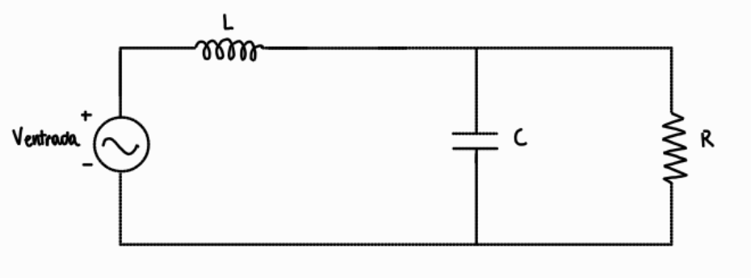
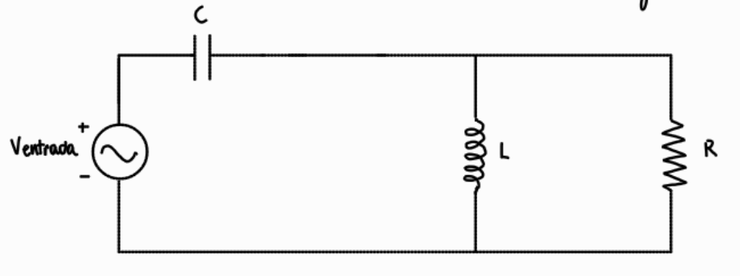
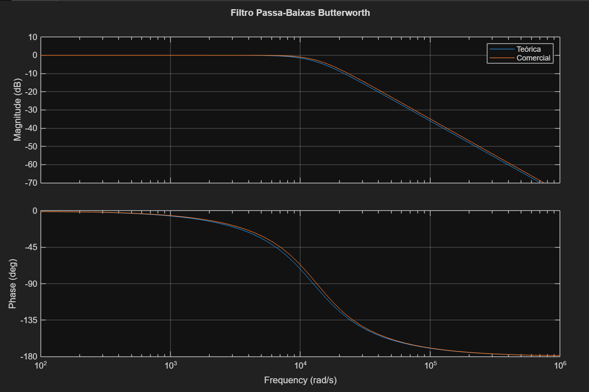
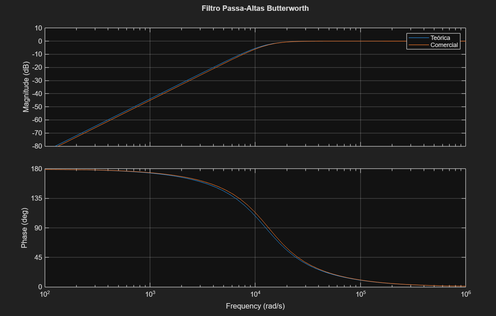

# Projeto de Filtros Passivos - Circuitos em Corrente Alternada
**Júlia Emanuelle Ulrich** -- Engenharia de Computação

## Sobre o Projeto
Este repositório contém o projeto de um crossover passivo para uma caixa de som de duas vias, composta por um woofer (para baixas frequências) e um tweeter (para altas frequências). O problema central resolvido aqui é separar e direcionar as frequências corretas para cada alto-falante, garantindo uma boa qualidade de áudio e evitando danos aos componentes.

Para fazer essa separação, projetei e implementei dois filtros de 2ª ordem com resposta Butterworth:
* **Filtro Passa-Baixas:** Deixa passar os sinais graves e manda direto para o woofer.
* **Filtro Passa-Altas:** Deixa passar os sinais agudos e manda para o tweeter.

## Especificações e Objetivos do Projeto
O objetivo prático é dimensionar os componentes teóricos e comerciais para que o divisor de frequências atue na faixa desejada. Os parâmetros base usados para o cálculo foram:
* **Frequência de Corte ($f_c$):** 2000 Hz
* **Impedância de Carga ($R$):** 8 Ω
* **Fator de Qualidade ($Q$):** $\frac{\sqrt{2}}{2} \approx 0.7071$ (característico do filtro Butterworth).

## Equacionamento e Fórmulas de Projeto
Abaixo mostro o passo a passo de como cheguei nas funções de transferência e nas fórmulas finais usando a análise de impedâncias no domínio da frequência.

### 1. Filtro Passa-Baixas (Woofer) - 2ª Ordem
O circuito do filtro passa-baixas é composto por um indutor ($L$) em série e um capacitor ($C$) em paralelo com a carga ($R$). 

*(Circuito do Filtro Passa-Baixas)* 

As impedâncias de cada elemento são definidas como:
* $Z_R = R$
* $Z_L = j\omega L$
* $Z_C = \frac{1}{j\omega C}$

A impedância equivalente ($Z_p$) do ramo paralelo (capacitor e carga) é:

$$Z_p = Z_C \parallel R = \frac{Z_C \cdot R}{Z_C + R} = \frac{(1/j\omega C) \cdot R}{(1/j\omega C) + R} \cdot \left(\frac{j\omega C}{j\omega C}\right)$$

$$Z_p = \frac{R}{1 + j\omega C R}$$

Aplicando a regra do divisor de tensão, a função de transferência $H(j\omega)$ fica assim:

$$H(j\omega) = \frac{V_{saida}}{V_{entrada}} = \frac{Z_p}{Z_L + Z_p}$$

Substituindo $Z_p$ e $Z_L$ e dando uma ajeitada na equação:

$$H(j\omega) = \frac{\frac{R}{1 + j\omega C R}}{j\omega L + \frac{R}{1 + j\omega C R}} \cdot \left(\frac{1 + j\omega C R}{1 + j\omega C R}\right)$$

$$H(j\omega) = \frac{R}{j\omega L (1 + j\omega C R) + R} = \frac{R}{j\omega L + (j\omega)^2 L C R + R}$$

Para chegar no formato padrão, dividimos o numerador e o denominador por $R$:

$$H(j\omega) = \frac{R/R}{\frac{j\omega L}{R} + \frac{(j\omega)^2 L C R}{R} + \frac{R}{R}} = \frac{1}{1 + j\omega \frac{L}{R} + (j\omega)^2 L C}$$

E, em seguida, dividimos os termos por $LC$:

$$H(j\omega) = \frac{1/LC}{\frac{1}{LC} + j\omega \frac{L/R}{LC} + \frac{(j\omega)^2 LC}{LC}} = \frac{1/LC}{(j\omega)^2 + j\omega \frac{1}{CR} + 1/LC}$$

Comparando com a equação padrão do filtro passa-baixas de 2ª ordem:

$$H(j\omega) = \frac{\omega_c^2}{(j\omega)^2 + \frac{\omega_c}{Q}(j\omega) + \omega_c^2}$$

A partir disso, chegamos nas seguintes relações para o Passa-Baixas:

**1)** $\omega_c^2 = \frac{1}{LC} \Rightarrow \omega_c = \frac{1}{\sqrt{LC}}$

**2)** $\frac{\omega_c}{Q} = \frac{1}{CR} \Rightarrow C = \frac{Q}{\omega_c R}$

---

### 2. Filtro Passa-Altas (Tweeter) - 2ª Ordem
O circuito do filtro passa-altas utiliza um capacitor ($C$) em série e um indutor ($L$) em paralelo com a carga ($R$).

*(Circuito do Filtro Passa-Altas)* 

A impedância do ramo paralelo ($Z_p$) formado pelo indutor e a carga é:

$$Z_p = Z_L \parallel R = \frac{Z_L \cdot R}{Z_L + R} = \frac{j\omega L \cdot R}{j\omega L + R}$$

Aplicando o divisor de tensão:

$$H(j\omega) = \frac{V_{saida}}{V_{entrada}} = \frac{Z_p}{Z_C + Z_p}$$

$$H(j\omega) = \frac{\frac{j\omega L R}{j\omega L + R}}{\frac{1}{j\omega C} + \frac{j\omega L R}{j\omega L + R}}$$

Manipulando a equação:

$$H(j\omega) = \frac{j\omega L R}{\frac{j\omega L + R}{j\omega C} + j\omega L R} \cdot \left(\frac{j\omega C}{j\omega C}\right)$$

$$H(j\omega) = \frac{(j\omega)^2 L C R}{R + j\omega L + (j\omega)^2 L C R}$$

Para chegar no formato padrão, dividimos o numerador e o denominador por $R$:

$$H(j\omega) = \frac{(j\omega)^2 L C}{1 + j\omega \frac{L}{R} + (j\omega)^2 L C}$$

E, em seguida, dividimos os termos por $LC$:

$$H(j\omega) = \frac{(j\omega)^2}{\frac{1}{LC} + j\omega \frac{1}{CR} + (j\omega)^2} = \frac{(j\omega)^2}{(j\omega)^2 + j\omega \frac{1}{CR} + 1/LC}$$

Comparando com a forma padrão do filtro passa-altas de 2ª ordem:

$$H(j\omega) = \frac{(j\omega)^2}{(j\omega)^2 + \frac{\omega_c}{Q}(j\omega) + \omega_c^2}$$

A partir disso, obtemos relações idênticas às do Passa-Baixas:

**1)** $\omega_c^2 = \frac{1}{LC} \Rightarrow \omega_c = \frac{1}{\sqrt{LC}}$

**2)** $\frac{\omega_c}{Q} = \frac{1}{CR} \Rightarrow C = \frac{Q}{\omega_c R}$

---

### 3. Fórmulas de Projeto (Cálculo de L e C)
Como deu para ver nas contas ali em cima, as equações dos componentes são as mesmas para os dois circuitos. Sabendo que em um filtro Butterworth o fator de qualidade é $Q = \frac{\sqrt{2}}{2}$:

**Cálculo do Capacitor ($C$):**
Substituindo $Q$ na relação $C = \frac{Q}{\omega_c R}$:
$$C = \frac{\frac{\sqrt{2}}{2}}{\omega_c R} \Rightarrow C = \frac{\sqrt{2}}{2 \omega_c R}$$

**Cálculo do Indutor ($L$):**
Isolando $L$ da equação $\omega_c^2 = \frac{1}{LC}$:
$$L = \frac{1}{\omega_c^2 C}$$

Substituindo a fórmula de $C$ que achamos antes:
$$L = \frac{1}{\omega_c^2 \left(\frac{Q}{\omega_c R}\right)} = \frac{R}{\omega_c Q}$$

Substituindo o valor de $Q = \frac{\sqrt{2}}{2}$:

$$L = \frac{R}{\omega_c \left(\frac{\sqrt{2}}{2}\right)} = \frac{2R}{\sqrt{2} \omega_c} \Rightarrow L = \frac{\sqrt{2} R}{\omega_c}$$

---

## Lógica do Programa
O programa desenvolvido para o projeto tem a seguinte lógica:

1. Entrada: Recebe os valores especificados de Impedância ($R$) e Frequência de Corte ($f_c$).
2. Cálculo: Utiliza as fórmulas matemáticas deduzidas para encontrar os valores teóricos exatos de $L$ e $C$.
3. Aproximação: Compara os valores teóricos com uma lista de componentes comerciais e seleciona os mais próximos.
4. Análise de Erro: Calcula a nova frequência de corte com base nas peças reais e verifica a diferença percentual.
5. Plotagem: Gera as funções de transferência e plota os Gráficos de Bode comparativos (Curva Teórica vs Curva Real).

## Como Executar o Código

1. Ter o MATLAB e a Toolbox Control System Toolbox instalados.
2. Baixe os arquivos deste repositório.
3. Rode o código. Insira a Frequência de Corte e a Impedância da Carga pedidas pelo programa. O terminal imprimirá os valores teóricos, os valores comerciais adotados e o erro percentual. Em seguida, a janela com os Gráficos de Bode se abrirá na tela. São duas abas, uma para cada filtro.

## Análise dos Resultados
Abaixo, o comparativo considerando os cálculos para $R$ = 8 Ω e $f_c$ = 2000 Hz:

* Para o **Indutor ($L$)**, o valor teórico calculado foi de 0.900 mH, mas o comercial mais próximo escolhido foi de 0.820 mH (erro de 8.89%).
* Para o **Capacitor ($C$)**, o valor teórico era 7.030 µF, e o comercial usado foi 6.800 µF (erro de 3.27%).
* Com essa troca de peças, a **Frequência de Corte ($f_c$)** real do circuito mudou de 2000 Hz para 2129.57 Hz (erro de 6.48%).

*(Gráfico gerado pelo código comparando a resposta Teórica vs Real)*  

## Análise Crítica
O principal desafio prático na montagem de filtros passivos é que os valores teóricos raramente estão disponíveis para compra. O arredondamento para os componentes padronizados deslocou a nossa frequência de corte em aproximadamente 130 Hz (de 2000 Hz para 2129.57 Hz).

Em um sistema físico, essa diferença não chega a ser audível nem compromete o funcionamento. O pequeno desvio na banda de transição acaba sendo mascarado pelas próprias tolerâncias de projeto e pela resposta natural dos alto-falantes.

## Conclusões
O projeto atingiu seu objetivo. Foi possível estruturar, equacionar e validar os filtros Butterworth de 2ª ordem a partir da análise matemática de circuitos e da simulação. 

Na prática, o desafio do projeto foi a adequação dos componentes. A análise mostrou que o uso de valores comerciais, em vez dos calculados teoricamente, causa somente uma pequena variação na frequência de corte.
